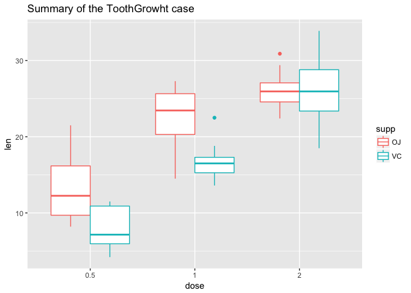

Part 2
------

Summary of the ToothGrowth dataset:

    qplot(factor(dose),len,data = ToothGrowth, col=supp, geom = "boxplot", 
          main = "Summary of the ToothGrowht case")+xlab("dose")

First of all, the datasets will be separated to several subgroups based
on supplement types and dosages.

    vc0.5 <- ToothGrowth %>% filter(supp=="VC"&dose==0.5)
    vc1.0 <- ToothGrowth %>% filter(supp=="VC"&dose==1.0)
    vc2.0 <- ToothGrowth %>% filter(supp=="VC"&dose==2.0)
    oj0.5 <- ToothGrowth %>% filter(supp=="OJ"&dose==0.5)
    oj1.0 <- ToothGrowth %>% filter(supp=="OJ"&dose==1.0)
    oj2.0 <- ToothGrowth %>% filter(supp=="OJ"&dose==2.0)

    vc0.5_1.0<-t.test(vc0.5$len,vc1.0$len,alternative = "two.sided", var.equal = TRUE)
    vc1.0_2.0<-t.test(vc1.0$len,vc2.0$len,alternative = "two.sided", var.equal = TRUE)
    oj0.5_1.0<-t.test(oj0.5$len,oj1.0$len,alternative = "two.sided", var.equal = TRUE)
    oj1.0_2.0<-t.test(oj1.0$len,oj2.0$len,alternative = "two.sided", var.equal = TRUE)
    vc_oj0.5<-t.test(vc0.5$len,oj0.5$len,alternative = "two.sided", var.equal = TRUE)
    vc_oj1.0<-t.test(vc1.0$len,oj1.0$len,alternative = "two.sided", var.equal = TRUE)
    vc_oj2.0<-t.test(vc2.0$len,oj2.0$len,alternative = "two.sided", var.equal = TRUE)

Comparison of the supp at the same dose level as below: (chunk supp in
Appendix)

    ## [1] "The conf. interval between the VC and OJ in the 0.5 dosage level is:"

    ## [1] "-8.73  -1.77"

    ## [1] "with p-value: 0.01"

    ## [1] "The conf. interval between the VC and OJ in the 1.0 dosage level is:"

    ## [1] "-9.02  -2.84"

    ## [1] "with p-value: 0.00"

    ## [1] "The conf. interval between the VC and OJ in the 2.0 dosage level is:"

    ## [1] "-3.56  3.72"

    ## [1] "with p-value: 0.96"

For the 0.5 dosage comparison, we can observe that the p-value is
smaller than 0.05 and the conf. does not contain the 0. So the null
hypothesis that the two supp at 0.5 dose level will be rejected. For the
1.0 dosage comparison, we can observe that the p-value is smaller than
0.05 and the conf. does not contain the 0. So the null hypothesis that
the two supp at 1.0 dose level will be rejected. For the 2.0 dosage
comparison, we can observe that the p-value is bigger than 0.05 and the
conf. contains the 0. So the null hypothesis that the two supp at 2.0
dose level will be rejected.

Comparison of the dose at the same supp type as below: (chunk dosage in
Appendix)

    ## [1] "The conf. interval of the 0.5 and 1.0 dosage level in the VC is:-11.26  -6.32"

    ## [1] "with p-value: 0.00"

    ## [1] "The conf. interval of the 1.0 and 2.0 dosage level in the VC is:-12.97  -5.77"

    ## [1] "with p-value: 0.00"

    ## [1] "The conf. interval of the 0.5 and 1.0 dosage level in the OJ is:-13.41  -5.53"

    ## [1] "with p-value: 0.00"

    ## [1] "The conf. interval of the 0.5 and 1.0 dosage level in the OJ is:-6.50  -0.22"

    ## [1] "with p-value: 0.04"

For the VC supp between 0.5 and 1.0 dosage, we can observe that the
p-value is smaller than 0.05 and the conf. does not contain the 0. So
the null hypothesis that the two dossages between 0.5 and 1.0 dosages
level are the same will be rejected. For the same VC supp between 1.0
and 2.0, the null hypothesis will be rejected as well.

For the OJ supp between 0.5 and 1.0 dosage, we can observe that the
p-value is smaller than 0.05 and the conf. does not contain the 0. So
the null hypothesis that the two dossages between 0.5 and 1.0 dosages
level are the same will be rejected. For the same OJ supp between 1.0
and 2.0, the null hypothesis will be rejected as well.

Conclusion
----------

For each type of supp, the more dose it was given, the longer teeth it
will have. 2.0 is the highest one during these experiments. Between the
two type of supps (OJ and VC), the OJ impacts more than the VC ones. But
once the dosage was 2.0, there is no significant differences of types
between these supps.

Appendix
========

chunk supp:

    sprintf("The conf. interval between the VC and OJ in the 0.5 dosage level is:")
            sprintf("%.2f  %.2f",vc_oj0.5$conf.[1],vc_oj0.5$conf.[2])
            sprintf("with p-value: %.2f",vc_oj0.5$p.)
    sprintf("The conf. interval between the VC and OJ in the 1.0 dosage level is:")
            sprintf("%.2f  %.2f",vc_oj1.0$conf.[1],vc_oj1.0$conf.[2]) 
            sprintf("with p-value: %.2f",vc_oj1.0$p.)
    sprintf("The conf. interval between the VC and OJ in the 2.0 dosage level is:")
            sprintf("%.2f  %.2f",vc_oj2.0$conf.[1],vc_oj2.0$conf.[2])
            sprintf("with p-value: %.2f",vc_oj2.0$p.)

chunk dosage:

    sprintf("The conf. interval of the 0.5 and 1.0 dosage level in the VC is:
            %.2f  %.2f",vc0.5_1.0$conf.[1],vc0.5_1.0$conf.[2])
            sprintf("with p-value: %.2f",vc0.5_1.0$p.)
    sprintf("The conf. interval of the 1.0 and 2.0 dosage level in the VC is:
            %.2f  %.2f",vc1.0_2.0$conf.[1],vc1.0_2.0$conf.[2])
            sprintf("with p-value: %.2f",vc1.0_2.0$p.)
    sprintf("The conf. interval of the 0.5 and 1.0 dosage level in the OJ is:
            %.2f  %.2f",oj0.5_1.0$conf.[1],oj0.5_1.0$conf.[2]) 
            sprintf("with p-value: %.2f",oj0.5_1.0$p.)
    sprintf("The conf. interval of the 0.5 and 1.0 dosage level in the OJ is:
            %.2f  %.2f", oj1.0_2.0$conf.[1],oj1.0_2.0$conf.[2]) 
            sprintf("with p-value: %.2f",oj1.0_2.0$p.)
